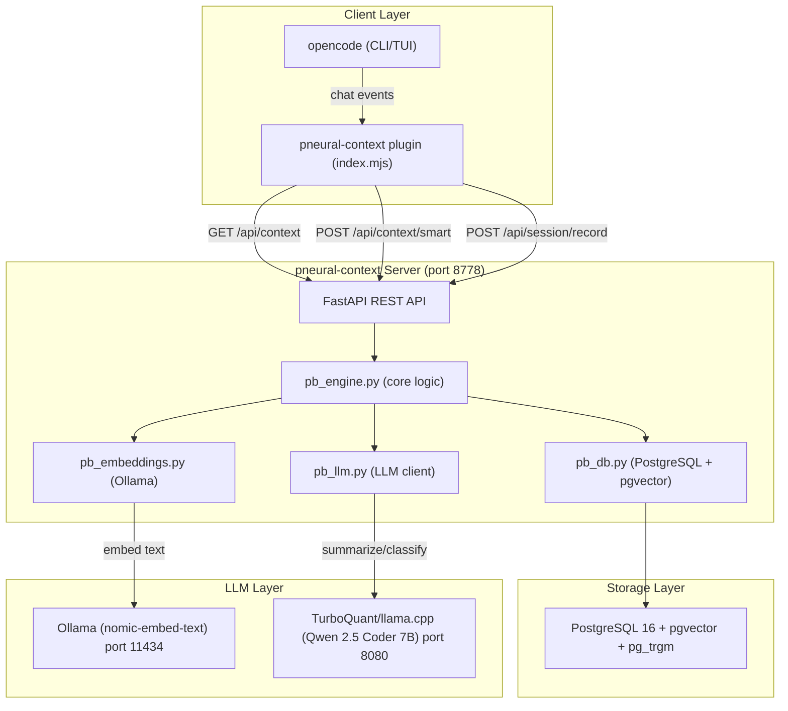
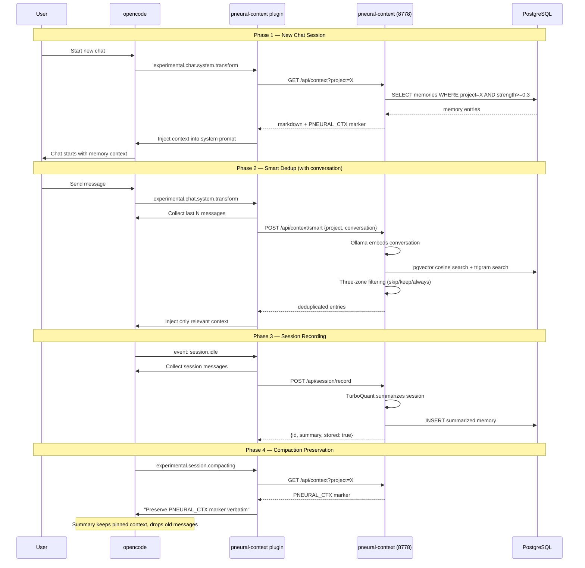
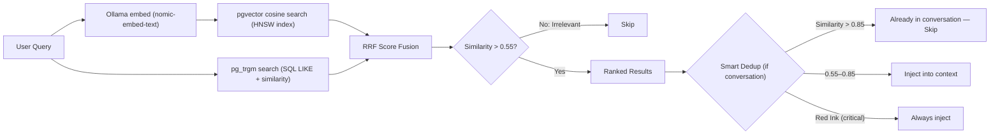
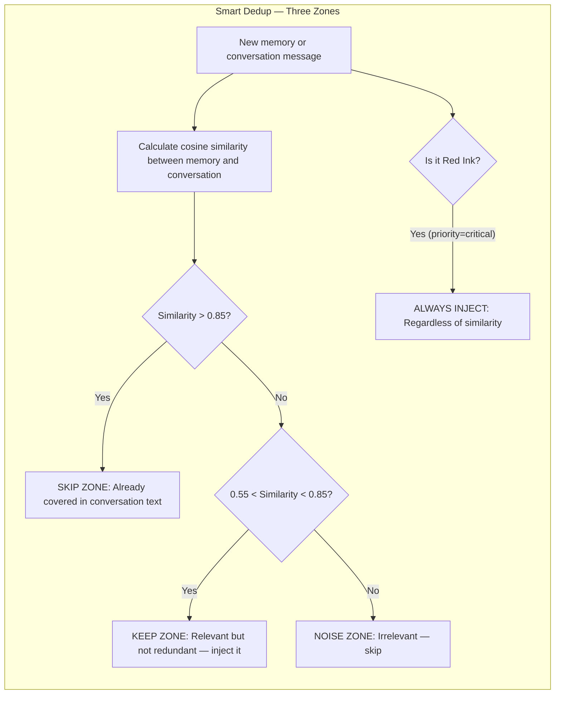
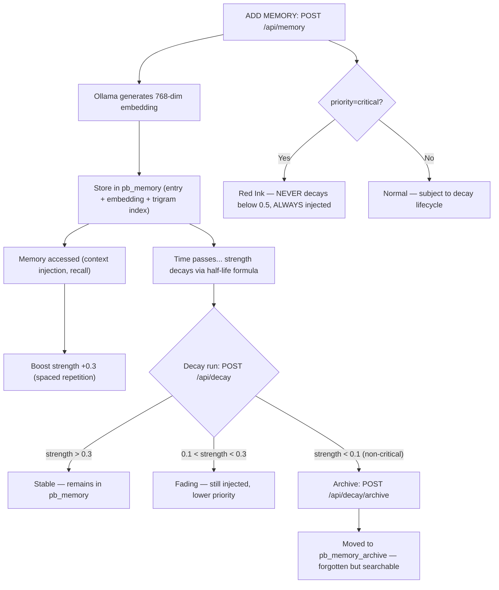
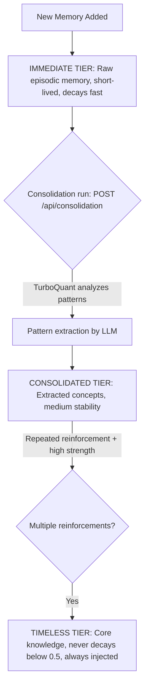
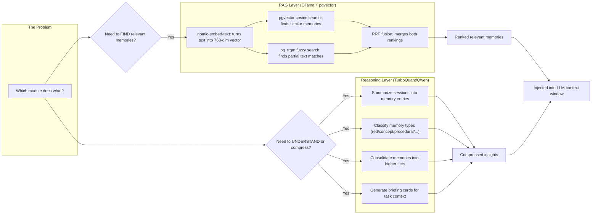

# pneural-context — Visual Architecture Guide

> Experimental visual documentation. These diagrams explain how the system works end-to-end.

## Quick Links

| Diagram | What It Shows |
|---------|--------------|
| [System Architecture](#1-system-architecture) | All components and their connections |
| [Injection Lifecycle](#2-injection-lifecycle) | How memories get injected into your LLM sessions |
| [RAG Pipeline](#3-rag-hybrid-search-pipeline) | How vector + trigram search finds relevant memories |
| [Smart Dedup Zones](#4-smart-dedup-zones) | Three-zone filtering to avoid redundant injection |
| [Memory Lifecycle](#5-memory-lifecycle) | From creation through decay to archive |
| [Consolidation Tiers](#6-consolidation-tiers) | How memories promote from immediate → timeless |
| [TurboQuant + RAG](#7-turboquant--rag-collaboration) | Which module does what — search vs reasoning |

---

## 1. System Architecture

The full stack: opencode client → plugin → pneural-context server → PostgreSQL + LLMs.



### Component Roles

| Component | Role | Port |
|-----------|------|------|
| **opencode** | CLI/TUI client that the user interacts with | — |
| **pneural-context plugin** | Hooks into opencode events, injects context, records sessions | — |
| **pneural-context server** | FastAPI REST API — the brain of the system | 8778 |
| **PostgreSQL + pgvector** | Persistent storage with vector similarity search | 5432 |
| **Ollama (nomic-embed-text)** | Turns text into 768-dim vectors for semantic search | 11434 |
| **TurboQuant (Qwen 7B)** | LLM for summarization, classification, consolidation | 8080 |

---

## 2. Injection Lifecycle

How memories get into your LLM sessions at the right time.



### The Four Phases

1. **New Chat** — Plugin fetches all relevant memories and injects them as a system prompt block marked with `<!-- PNEURAL_CTX: xxxxxx -->`
2. **Smart Dedup** — When conversation exists, only inject memories not already covered. Uses embedding similarity to detect redundancy.
3. **Session Recording** — When a chat session goes idle, the LLM summarizes it into a compact memory entry stored for future recall.
4. **Compaction Preservation** — When opencode compacts the conversation (context overflow), the plugin ensures the PNEURAL_CTX block is preserved in the summary.

---

## 3. RAG Hybrid Search Pipeline

How pneural-context finds the right memories using both vector similarity and text matching.



### Why Hybrid?

| Search Type | Good At | Bad At |
|------------|---------|--------|
| **pgvector (semantic)** | Conceptual matches ("deploy" ≈ "release") | Exact keyword matches |
| **pg_trgm (text)** | Typos, partial matches, exact terms | Can't find synonyms |
| **RRF Fusion** | Best of both — ranked by combined evidence | — |

Reciprocal Rank Fusion (RRF) combines both rankings:
```
score(memory) = 1/(k + rank_vector) + 1/(k + rank_trigram)
```

---

## 4. Smart Dedup Zones

When injecting context into a conversation, memories are filtered through three zones based on their similarity to what's already in the conversation.



### Examples

| Zone | Similarity | Example | Action |
|------|-----------|---------|--------|
| **Skip** | > 0.85 | Memory: "Use git rebase for updates" / Conversation: "...git rebase for updates..." | Don't inject — user already knows |
| **Keep** | 0.55–0.85 | Memory: "Use env vars for secrets" / Conversation: "...CI pipeline setup..." | Inject — relevant new info |
| **Noise** | < 0.55 | Memory: "Meeting notes from Jan" / Conversation: "...deployment config..." | Don't inject — irrelevant |
| **Always** | Any | Memory: "NEVER commit secrets" (priority=critical) | Always inject, even if similar |

---

## 5. Memory Lifecycle

From creation through decay to archive — memories evolve over time.



### Key Concepts

- **Spaced Repetition**: Every time a memory is accessed (injected into context), its strength increases by +0.3 (capped at 1.0)
- **Decay**: Strength decays over time using a half-life formula. The default half-life is 7 days — after 7 days without access, strength drops to 50%
- **Archive**: Memories below 0.1 strength are moved to `pb_memory_archive`. They're "forgotten" but still searchable via `/api/recall`
- **Red Ink**: Critical-priority memories are protected. They never decay below 0.5 and are always injected regardless of dedup

---

## 6. Consolidation Tiers

Memories promote through three tiers as they're reinforced over time.



### Tier Properties

| Tier | Table | Half-life | Strength Floor | Auto-injected? |
|------|-------|-----------|---------------|----------------|
| **Immediate** | `pb_memory` | Hours–days | 0.0 (can decay to 0) | Yes, if strength > 0.3 |
| **Consolidated** | `pb_consolidated_memory` | Weeks–months | 0.3 | Yes |
| **Timeless** | `pb_consolidated_memory` (tier=timeless) | Never | 0.5 | Always |

### Promotion Logic

1. **Immediate → Consolidated**: TurboQuant groups related immediate memories and extracts a concept
2. **Consolidated → Timeless**: Memories with high reinforcement score (multiple successes) promote to timeless
3. **Red Ink stays in Immediate**: Critical-priority memories never leave `pb_memory` — they're always at full strength

---

## 7. TurboQuant + RAG Collaboration

The two LLM-backed modules serve completely different purposes. Understanding this division is key.



### Division of Labor

| Task | Module | Why |
|------|--------|-----|
| Find memories similar to a query | **Ollama (RAG)** | Vector similarity is fast and exact |
| Find memories matching text fragments | **pg_trgm (RAG)** | Fuzzy text matching, no LLM needed |
| Merge vector + trigram results | **RRF (RAG)** | Pure math, no LLM needed |
| Decide if a memory is redundant | **Ollama (RAG)** | Embed similarity tells us overlap |
| Summarize a chat session | **TurboQuant (Reasoning)** | Needs language understanding |
| Classify a memory's type | **TurboQuant (Reasoning)** | Needs semantic comprehension |
| Consolidate memories into concepts | **TurboQuant (Reasoning)** | Needs abstraction ability |
| Generate a briefing card | **TurboQuant (Reasoning)** | Needs synthesis + prioritization |

### Cost Implications

| Module | When Called | Latency | Token Cost |
|--------|-----------|---------|------------|
| **Ollama (embed)** | Every write + every smart context request | ~50ms | 0 (local) |
| **TurboQuant (reasoning)** | Session record, consolidation, briefing, classify | ~2-5s | 0 (local) |

Both run locally — no API costs. TurboQuant is slower because it generates full text completions, while Ollama embedding is a single forward pass.

---

## API Quick Reference

| Endpoint | Method | Purpose | LLM Needed? |
|----------|--------|---------|-------------|
| `GET /health` | GET | Health check | No |
| `GET /api/memory` | GET | List memories | No |
| `POST /api/memory` | POST | Add memory | No (embed yes) |
| `GET /api/context` | GET | Get injected context | No |
| `POST /api/context/smart` | POST | Smart dedup context | Yes (embed) |
| `POST /api/recall` | GET | Semantic + trigram search | Yes (embed, if semantic=true) |
| `POST /api/session/record` | POST | Record + summarize session | Yes (TurboQuant) |
| `POST /api/consolidation` | POST | Run consolidation | Yes (TurboQuant) |
| `POST /api/decay` | POST | Run decay | No |
| `POST /api/decay/archive` | POST | Archive weak memories | No |
| `GET /api/decay/status` | GET | Check decay status | No |

---

## Configuration

| Variable | Default | Purpose |
|----------|---------|---------|
| `PNEURAL_DATABASE_URL` | — | PostgreSQL connection string |
| `PNEURAL_LLM_URL` | `http://localhost:12345/v1` | LLM endpoint (TurboQuant) |
| `PNEURAL_LLM_MODEL` | `local-model` | LLM model name |
| `PNEURAL_PORT` | `8777` | Server port |
| `PNEURAL_EMBED_BACKEND` | `ollama` | Embedding backend (ollama or python) |
| `PNEURAL_EMBED_URL` | `http://localhost:11434` | Ollama URL |
| `PNEURAL_EMBED_MODEL` | `nomic-embed-text` | Embedding model |
| `PNEURAL_EMBED_DIMENSIONS` | `768` | Vector dimensions |
| `PNEURAL_DEDUP_THRESHOLD_HIGH` | `0.85` | Skip zone threshold |
| `PNEURAL_DEDUP_THRESHOLD_LOW` | `0.55` | Noise zone threshold |
